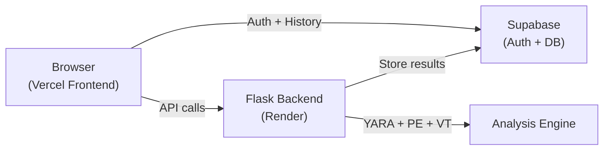
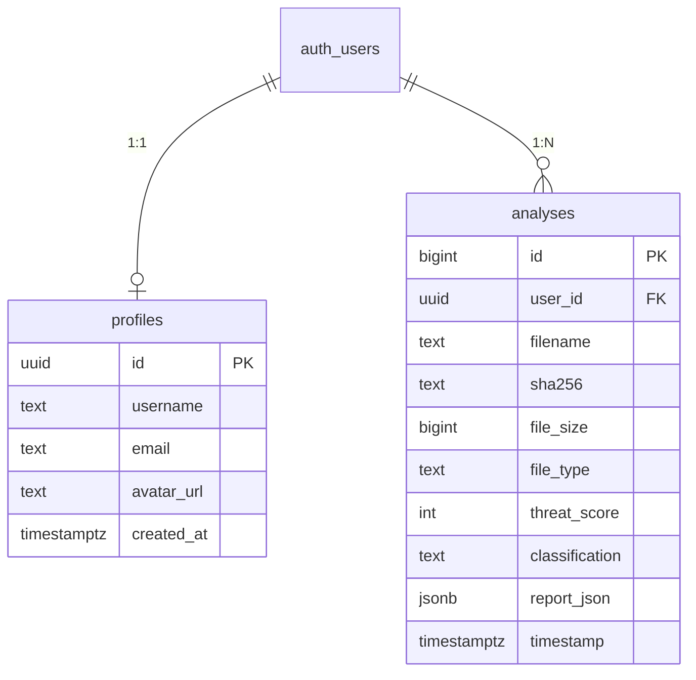
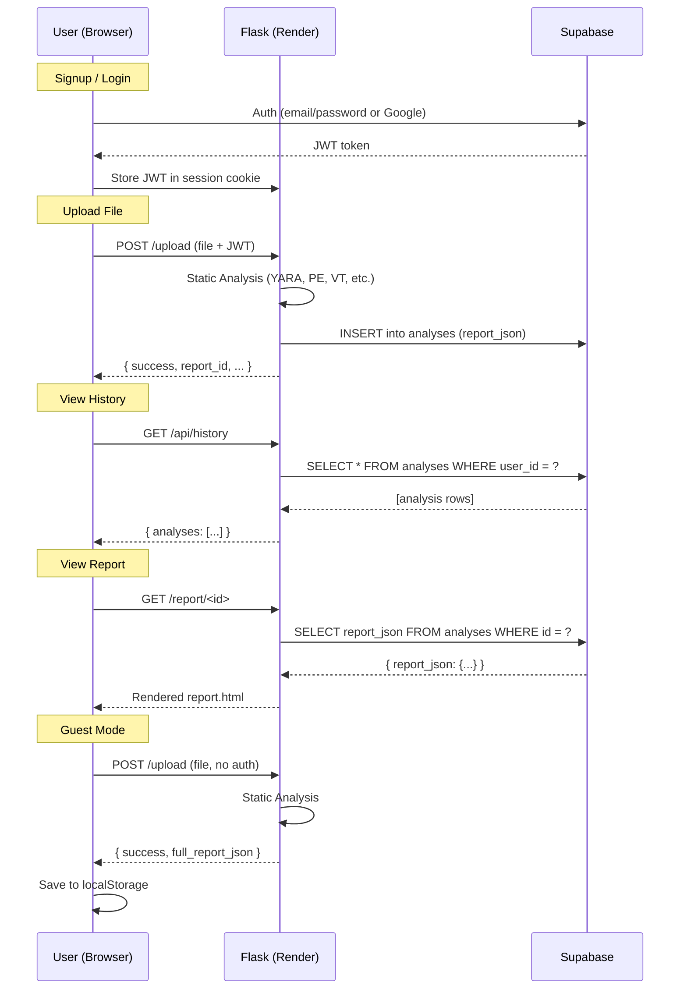

# 🛡️ MalVizor — Supabase Integration & Deployment Plan

## 📊 Project Analysis Summary

### Current Architecture
| Component | Technology | Details |
|---|---|---|
| **Backend** | Python Flask | `app.py` — 393 lines, routes: login, upload, report, history, PDF |
| **Database** | SQLite (`analyzer.db`) | Single `analyses` table, local file-based |
| **Auth** | Hardcoded credentials | `config.py` → `bunty` / `bunty123` |
| **Analysis Engine** | `static_analysis.py` (1341 lines) | PE parsing, YARA, VirusTotal, MITRE ATT&CK, entropy, strings |
| **Report Generator** | `report_generator.py` (229 lines) | Scoring engine, classification, IST timestamps |
| **Frontend** | Jinja2 templates + inline CSS/JS | `index.html` (1473 lines), `report.html`, `login.html`, `pdf_report.html` |
| **Guest Mode** | Session-based flag | Guest analyses saved to SQLite with `is_guest=1` |

### Key Files
| File | Size | Role |
|---|---|---|
| [app.py](file:///d:/project/MalVizormain/malware-behavior-analyzer/app.py) | 14 KB | Flask routes, auth, file upload, PDF generation |
| [config.py](file:///d:/project/MalVizormain/malware-behavior-analyzer/config.py) | 1.7 KB | All configuration: paths, API keys, credentials |
| [database.py](file:///d:/project/MalVizormain/malware-behavior-analyzer/database.py) | 4.9 KB | SQLite ORM-less DB layer |
| [static_analysis.py](file:///d:/project/MalVizormain/malware-behavior-analyzer/analyzer/static_analysis.py) | 63 KB | Core analysis engine |
| [report_generator.py](file:///d:/project/MalVizormain/malware-behavior-analyzer/analyzer/report_generator.py) | 10 KB | Threat scoring & report generation |
| [index.html](file:///d:/project/MalVizormain/malware-behavior-analyzer/templates/index.html) | 96 KB | Dashboard with history, charts, search |
| [login.html](file:///d:/project/MalVizormain/malware-behavior-analyzer/templates/login.html) | 15 KB | Login page with guest option |
| [report.html](file:///d:/project/MalVizormain/malware-behavior-analyzer/templates/report.html) | 158 KB | Full analysis report view |
| [main.js](file:///d:/project/MalVizormain/malware-behavior-analyzer/static/js/main.js) | 8 KB | Upload, history loading, UI logic |

### Dependencies (current)
`Flask`, `pefile`, `yara-python`, `requests`, `weasyprint`

---

## 🏗️ Architecture Decision: Vercel vs Render

> [!IMPORTANT]
> **Your Flask backend cannot run on Vercel directly.** Vercel is designed for frontend/serverless — it has a 10-second timeout on free tier and doesn't support long-running Python processes, file system writes, or persistent storage. Your analysis engine needs file uploads, YARA scanning, PE parsing, and VirusTotal API calls — all of which require a real server.

### Recommended Architecture



| Layer | Platform | Cost | Purpose |
|---|---|---|---|
| **Frontend** | **Vercel** (free) | $0 | Serve static HTML/CSS/JS, redirect to backend |
| **Backend** | **Render** (free) | $0 | Flask API — file upload, analysis, PDF generation |
| **Database + Auth** | **Supabase** (free) | $0 | User auth (email/password, Google), analysis history storage |

> [!TIP]
> **Alternative: Host EVERYTHING on Render** — you can deploy the full Flask app (with templates) directly on Render and skip Vercel entirely. This is simpler and I recommend it for your project. Vercel can just redirect to Render's URL, or you can use Render as your only host.

### Simplest Approach (Recommended): **Render-only deployment**
- Deploy Flask app (backend + frontend templates) on **Render**
- Use **Supabase** for auth and history storage
- No need for Vercel at all (or use Vercel just as a redirect/landing page)

---

## 🔐 Step 1: Supabase Account & Project Setup

### 1.1 Create Supabase Project
1. Go to [https://supabase.com](https://supabase.com)
2. Sign up / Login with GitHub
3. Click **"New Project"**
4. Fill in:
   - **Organization**: Your org (or create one)
   - **Project name**: `malvizor`
   - **Database password**: Generate a strong one → **SAVE IT**
   - **Region**: Choose closest (e.g., `ap-south-1` for India)
5. Wait for project to provision (~2 minutes)

### 1.2 Get Your API Keys
After project is created, go to **Settings → API**:

| Key | Where to find | Usage |
|---|---|---|
| **Project URL** | `Settings → API → Project URL` | `https://xxxxx.supabase.co` |
| **anon (public) key** | `Settings → API → Project API Keys → anon` | Frontend auth calls |
| **service_role key** | `Settings → API → Project API Keys → service_role` | Backend DB writes (KEEP SECRET) |

### 1.3 Enable Email/Password Auth
1. Go to **Authentication → Providers**
2. **Email** should be enabled by default
3. Optionally enable **Google OAuth**:
   - Go to Google Cloud Console → Create OAuth credentials
   - Add `https://xxxxx.supabase.co/auth/v1/callback` as redirect URI
   - Paste Client ID & Secret in Supabase

### 1.4 Disable Email Confirmation (for easy testing)
1. Go to **Authentication → Settings → Email**
2. Toggle OFF **"Confirm email"** (you can enable later for production)

---

## 🗄️ Step 2: Supabase Database Tables

### 2.1 Create Tables

Go to **SQL Editor** in Supabase Dashboard and run this SQL:

```sql
-- ═══════════════════════════════════════════════
-- MalVizor — Supabase Database Schema
-- ═══════════════════════════════════════════════

-- 1. User Profiles (extends Supabase auth.users)
CREATE TABLE IF NOT EXISTS public.profiles (
    id          UUID PRIMARY KEY REFERENCES auth.users(id) ON DELETE CASCADE,
    username    TEXT UNIQUE,
    email       TEXT,
    avatar_url  TEXT,
    created_at  TIMESTAMPTZ DEFAULT NOW(),
    updated_at  TIMESTAMPTZ DEFAULT NOW()
);

-- 2. Analysis History (replaces SQLite analyses table)
CREATE TABLE IF NOT EXISTS public.analyses (
    id              BIGINT GENERATED ALWAYS AS IDENTITY PRIMARY KEY,
    user_id         UUID REFERENCES auth.users(id) ON DELETE CASCADE,
    filename        TEXT NOT NULL,
    sha256          TEXT NOT NULL,
    file_size       BIGINT,
    file_type       TEXT,
    threat_score    INTEGER DEFAULT 0,
    classification  TEXT DEFAULT 'unknown',
    report_json     JSONB,           -- Store full report as JSON (no filesystem dependency)
    timestamp       TIMESTAMPTZ DEFAULT NOW(),
    created_at      TIMESTAMPTZ DEFAULT NOW()
);

-- 3. Indexes for fast queries
CREATE INDEX IF NOT EXISTS idx_analyses_user_id ON public.analyses(user_id);
CREATE INDEX IF NOT EXISTS idx_analyses_timestamp ON public.analyses(timestamp DESC);
CREATE INDEX IF NOT EXISTS idx_analyses_classification ON public.analyses(classification);

-- ═══════════════════════════════════════════════
-- Row Level Security (RLS) — CRITICAL
-- Users can only see/edit their own data
-- ═══════════════════════════════════════════════

ALTER TABLE public.profiles ENABLE ROW LEVEL SECURITY;
ALTER TABLE public.analyses ENABLE ROW LEVEL SECURITY;

-- Profiles: users can read/update their own profile
CREATE POLICY "Users can view own profile"
    ON public.profiles FOR SELECT
    USING (auth.uid() = id);

CREATE POLICY "Users can update own profile"
    ON public.profiles FOR UPDATE
    USING (auth.uid() = id);

CREATE POLICY "Users can insert own profile"
    ON public.profiles FOR INSERT
    WITH CHECK (auth.uid() = id);

-- Analyses: users can CRUD their own analyses
CREATE POLICY "Users can view own analyses"
    ON public.analyses FOR SELECT
    USING (auth.uid() = user_id);

CREATE POLICY "Users can insert own analyses"
    ON public.analyses FOR INSERT
    WITH CHECK (auth.uid() = user_id);

CREATE POLICY "Users can delete own analyses"
    ON public.analyses FOR DELETE
    USING (auth.uid() = user_id);

-- ═══════════════════════════════════════════════
-- Auto-create profile on signup (trigger)
-- ═══════════════════════════════════════════════

CREATE OR REPLACE FUNCTION public.handle_new_user()
RETURNS TRIGGER AS $$
BEGIN
    INSERT INTO public.profiles (id, email, username)
    VALUES (
        NEW.id,
        NEW.email,
        COALESCE(NEW.raw_user_meta_data->>'username', SPLIT_PART(NEW.email, '@', 1))
    );
    RETURN NEW;
END;
$$ LANGUAGE plpgsql SECURITY DEFINER;

-- Drop trigger if exists (idempotent)
DROP TRIGGER IF EXISTS on_auth_user_created ON auth.users;

CREATE TRIGGER on_auth_user_created
    AFTER INSERT ON auth.users
    FOR EACH ROW
    EXECUTE FUNCTION public.handle_new_user();

-- ═══════════════════════════════════════════════
-- Service role policy (for backend writes)
-- The Flask backend uses service_role key to
-- bypass RLS when saving analysis results
-- ═══════════════════════════════════════════════

CREATE POLICY "Service role full access on analyses"
    ON public.analyses FOR ALL
    USING (true)
    WITH CHECK (true);
```

> [!WARNING]
> The last policy grants full access to anyone with the `service_role` key. This key must **NEVER** be exposed to the frontend — only use it in your Flask backend (Render environment variables).

### 2.2 Table Schema Overview



---

## 📝 Step 3: Code Changes — Backend

### 3.1 New Dependencies

Add to `requirements.txt`:
```
supabase>=2.0.0
python-dotenv>=1.0.0
gunicorn>=21.2.0
```

### 3.2 New `.env` File (DO NOT COMMIT)

```env
# Supabase
SUPABASE_URL=https://xxxxx.supabase.co
SUPABASE_ANON_KEY=eyJhbGciOi...
SUPABASE_SERVICE_KEY=eyJhbGciOi...

# Flask
SECRET_KEY=generate-a-random-string-here
VIRUSTOTAL_API_KEY=d176b674412016944606d7e631064983c7e08f3dd0ec1fd527dbccd8dfbb09b3

# Deployment
PORT=5000
DEBUG=false
```

### 3.3 Update `config.py`

```python
import os
from dotenv import load_dotenv

load_dotenv()

BASE_DIR = os.path.dirname(os.path.abspath(__file__))

# ─── Supabase ────────────────────────────────
SUPABASE_URL         = os.getenv("SUPABASE_URL", "")
SUPABASE_ANON_KEY    = os.getenv("SUPABASE_ANON_KEY", "")
SUPABASE_SERVICE_KEY = os.getenv("SUPABASE_SERVICE_KEY", "")

# ─── File Paths ──────────────────────────────
UPLOAD_FOLDER  = os.path.join(BASE_DIR, "uploads")
REPORTS_FOLDER = os.path.join(BASE_DIR, "reports")

# ─── YARA Rules ──────────────────────────────
YARA_RULES_PATH = os.path.join(BASE_DIR, "rules", "malware_rules.yar")

# ─── Upload Limits ───────────────────────────
MAX_FILE_SIZE = 100 * 1024 * 1024  # 100 MB

# ─── VirusTotal API ──────────────────────────
VIRUSTOTAL_API_KEY = os.getenv("VIRUSTOTAL_API_KEY", "")

# ─── Flask Settings ──────────────────────────
SECRET_KEY = os.getenv("SECRET_KEY", "mba-secret-key-change-me-2024")
DEBUG = os.getenv("DEBUG", "true").lower() == "true"
PORT  = int(os.getenv("PORT", 5000))

# ─── Auto-create required folders ────────────
for folder in [UPLOAD_FOLDER, REPORTS_FOLDER]:
    os.makedirs(folder, exist_ok=True)
```

### 3.4 New `supabase_client.py` — Replaces `database.py` for logged-in users

```python
from supabase import create_client, Client
import config

# Service-role client for backend operations (bypasses RLS)
_supabase: Client = None

def get_supabase() -> Client:
    global _supabase
    if _supabase is None:
        _supabase = create_client(config.SUPABASE_URL, config.SUPABASE_SERVICE_KEY)
    return _supabase

def save_analysis(user_id: str, report: dict) -> int:
    """Save analysis to Supabase for a logged-in user."""
    sb = get_supabase()
    summary = report.get("summary", {})
    static = report.get("static_analysis", {})
    
    raw_ft = static.get("file_type", "")
    summary_ft = summary.get("file_type", "")
    file_type = raw_ft if raw_ft and raw_ft.lower() not in ("", "unknown", "n/a") else summary_ft or None
    
    data = {
        "user_id": user_id,
        "filename": summary.get("file_name", "unknown"),
        "sha256": summary.get("sha256", ""),
        "file_size": static.get("file_size", summary.get("file_size", 0)),
        "file_type": file_type,
        "threat_score": summary.get("threat_score", 0),
        "classification": summary.get("classification", "unknown"),
        "report_json": report,  # Store entire report as JSONB
        "timestamp": summary.get("timestamp", None),
    }
    
    result = sb.table("analyses").insert(data).execute()
    return result.data[0]["id"] if result.data else 0

def get_all_analyses(user_id: str) -> list:
    """Get all analyses for a specific user."""
    sb = get_supabase()
    result = sb.table("analyses") \
        .select("id, filename, sha256, file_size, file_type, threat_score, classification, timestamp") \
        .eq("user_id", user_id) \
        .order("timestamp", desc=True) \
        .execute()
    return result.data or []

def get_analysis(analysis_id: int, user_id: str = None) -> dict | None:
    """Get a single analysis by ID."""
    sb = get_supabase()
    query = sb.table("analyses").select("*").eq("id", analysis_id)
    if user_id:
        query = query.eq("user_id", user_id)
    result = query.single().execute()
    return result.data if result.data else None

def delete_analysis(analysis_id: int, user_id: str) -> bool:
    """Delete an analysis (user must own it)."""
    sb = get_supabase()
    sb.table("analyses").delete().eq("id", analysis_id).eq("user_id", user_id).execute()
    return True
```

### 3.5 Update `app.py` — Key Changes

| What Changes | Details |
|---|---|
| **Auth** | Replace hardcoded login with Supabase email/password auth |
| **Session** | Store Supabase JWT + user_id in Flask session |
| **Upload route** | Save to Supabase for logged-in users |
| **History API** | Fetch from Supabase for logged-in users |
| **Report route** | Read `report_json` from Supabase instead of filesystem |
| **Guest mode** | Unchanged — guest reports returned in response, stored in localStorage by frontend |
| **New routes** | `/auth/signup`, `/auth/login`, `/auth/callback` (for Google OAuth) |

### 3.6 Login Page Changes (`login.html`)

Replace the hardcoded username/password form with:
- **Email + Password** fields (Supabase auth)
- **Sign Up** link/toggle
- **Google OAuth** button (optional)
- Keep **"Continue as Guest"** button exactly as-is

---

## 🖥️ Step 4: Frontend Changes

### 4.1 Guest Mode — localStorage History

The current `main.js` calls `/api/history` for everyone. For guests, we need to:

```javascript
// After a successful upload response for a guest:
if (response.guest_mode) {
    // Save to localStorage
    const history = JSON.parse(localStorage.getItem('malvizor_guest_history') || '[]');
    history.unshift({
        id: response.report_id,
        filename: response.filename,
        file_type: response.file_type,
        threat_score: response.threat_score,
        classification: response.classification,
        timestamp: response.timestamp,
        report_data: null  // Full report loaded on-demand
    });
    localStorage.setItem('malvizor_guest_history', JSON.stringify(history));
}
```

When loading history:
```javascript
function loadHistory() {
    if (window.SESSION.guest) {
        // Load from localStorage
        const history = JSON.parse(localStorage.getItem('malvizor_guest_history') || '[]');
        renderHistory(history);
        updateStats(history);
    } else if (window.SESSION.logged_in) {
        // Load from Supabase via API
        fetch('/api/history')
            .then(res => res.json())
            .then(data => {
                renderHistory(data.analyses || []);
                updateStats(data.analyses || []);
            });
    }
}
```

### 4.2 Report Storage for Guests

Currently guest reports are saved to SQLite (which won't exist on Render's ephemeral filesystem). Change:
- **Backend**: Return the full report JSON in the upload response
- **Frontend**: Store full report JSON in `localStorage` keyed by report_id
- **Report page**: For guests, load from localStorage; for logged-in users, load from Supabase `report_json` column

---

## 🚀 Step 5: Deployment Setup

### 5.1 Render Deployment (Backend)

#### Create `render.yaml` (Infrastructure as Code)
```yaml
services:
  - type: web
    name: malvizor
    runtime: python
    plan: free
    buildCommand: pip install -r requirements.txt
    startCommand: gunicorn app:app --bind 0.0.0.0:$PORT --timeout 120
    envVars:
      - key: SUPABASE_URL
        sync: false
      - key: SUPABASE_ANON_KEY
        sync: false
      - key: SUPABASE_SERVICE_KEY
        sync: false
      - key: SECRET_KEY
        sync: false
      - key: VIRUSTOTAL_API_KEY
        sync: false
      - key: DEBUG
        value: "false"
    autoDeploy: true
```

#### Steps:
1. Go to [https://render.com](https://render.com) → Sign up with GitHub
2. Click **"New" → "Web Service"**
3. Connect your GitHub repo (`malware-behavior-analyzer`)
4. Settings:
   - **Runtime**: Python 3
   - **Build command**: `pip install -r requirements.txt`
   - **Start command**: `gunicorn app:app --bind 0.0.0.0:$PORT --timeout 120`
   - **Plan**: Free
5. Add **Environment Variables** (from your `.env` file):
   - `SUPABASE_URL`, `SUPABASE_ANON_KEY`, `SUPABASE_SERVICE_KEY`
   - `SECRET_KEY`, `VIRUSTOTAL_API_KEY`
   - `DEBUG=false`
6. Deploy!

> [!WARNING]  
> **Render free tier limitations:**
> - Server spins down after 15 min of inactivity (cold start ~30s)
> - Ephemeral filesystem — uploaded files and reports are lost on restart (that's why we store reports in Supabase JSONB)
> - 512 MB RAM — enough for your analysis engine

### 5.2 Vercel Setup (Optional — Frontend redirect)

If you still want a Vercel URL, you can create a simple redirect:

```json
// vercel.json
{
  "redirects": [
    { "source": "/(.*)", "destination": "https://malvizor.onrender.com/$1", "permanent": false }
  ]
}
```

Or use Vercel as a static landing page that links to the Render-hosted app.

### 5.3 Important: YARA Rules on Render

> [!CAUTION]
> `yara-python` requires the `yara` system library. On Render, you'll need to install it. Add a `Dockerfile` or use a build script:

Create `build.sh`:
```bash
#!/bin/bash
apt-get update && apt-get install -y yara libpango-1.0-0 libcairo2
pip install -r requirements.txt
```

Set Render build command to: `bash build.sh`

**OR** use a Dockerfile for more control:
```dockerfile
FROM python:3.11-slim

RUN apt-get update && apt-get install -y \
    yara libpango-1.0-0 libcairo2 libgdk-pixbuf-2.0-0 \
    && rm -rf /var/lib/apt/lists/*

WORKDIR /app
COPY . .
RUN pip install --no-cache-dir -r requirements.txt

EXPOSE 5000
CMD ["gunicorn", "app:app", "--bind", "0.0.0.0:5000", "--timeout", "120"]
```

---

## 📋 Step-by-Step Implementation Checklist

### Phase 1: Supabase Setup (30 min)
- [ ] Create Supabase project
- [ ] Run SQL schema (tables + RLS + triggers)
- [ ] Enable Email auth provider
- [ ] (Optional) Enable Google OAuth
- [ ] Copy API keys (URL, anon key, service_role key)

### Phase 2: Backend Code Changes (2-3 hours)
- [ ] Create `.env` file with Supabase credentials
- [ ] Add `supabase`, `python-dotenv`, `gunicorn` to `requirements.txt`
- [ ] Update `config.py` — env vars instead of hardcoded values
- [ ] Create `supabase_client.py` — Supabase DB operations
- [ ] Update `app.py`:
  - [ ] New auth routes: `/auth/signup`, `/auth/login` (Supabase email/password)
  - [ ] Update `/upload` — save to Supabase for logged-in users
  - [ ] Update `/api/history` — fetch from Supabase
  - [ ] Update `/report/<id>` — load `report_json` from Supabase
  - [ ] Update `/api/delete/<id>` — delete from Supabase
  - [ ] Guest mode — return full report JSON in upload response
- [ ] Add `.env` to `.gitignore`

### Phase 3: Frontend Changes (1-2 hours)
- [ ] Update `login.html` — email/password form, signup toggle, Google button
- [ ] Update `main.js`:
  - [ ] Guest history: save/load from `localStorage`
  - [ ] Guest reports: store full JSON in `localStorage`
  - [ ] Logged-in history: fetch from `/api/history` (unchanged)
- [ ] Update `index.html`:
  - [ ] Guest history table reads from localStorage
  - [ ] Guest report links use localStorage data
- [ ] Update `report.html` — handle guest vs logged-in report loading

### Phase 4: Deployment (1 hour)
- [ ] Add `gunicorn` to requirements
- [ ] Create `Dockerfile` (for YARA + WeasyPrint system deps)
- [ ] Create `render.yaml` (optional — for auto-deploy)
- [ ] Push to GitHub
- [ ] Create Render web service → connect repo → set env vars → deploy
- [ ] Test: signup, login, upload, view report, history, guest mode
- [ ] (Optional) Set up Vercel redirect to Render URL

### Phase 5: Polish (30 min)
- [ ] Update `README.md` with new setup instructions
- [ ] Test Google OAuth flow (if enabled)
- [ ] Test guest localStorage persistence
- [ ] Verify RLS — users can't see each other's analyses
- [ ] Remove hardcoded credentials from `config.py`

---

## ⚠️ Important Notes

> [!CAUTION]
> **Security: Remove hardcoded secrets before pushing to GitHub!**
> - Your VirusTotal API key is currently hardcoded in `config.py` — move to `.env`
> - Your login credentials (`bunty/bunty123`) are in `config.py` — will be replaced by Supabase auth
> - Add `.env` to `.gitignore` immediately

> [!NOTE]
> **Report storage change:** Currently reports are saved as JSON files in `/reports/`. On Render's ephemeral filesystem, these files are lost on restart. The fix: store the entire report as JSONB in Supabase's `report_json` column. No file system dependency.

> [!TIP]
> **WeasyPrint (PDF export) on Render:** WeasyPrint requires system libraries (`libpango`, `libcairo`). The Dockerfile handles this. If you want to avoid the complexity, you can disable PDF export on the deployed version and only use it locally.

---

## 🔄 Data Flow After Changes



---

**Ready to proceed? Let me know which phase to start implementing first!**
